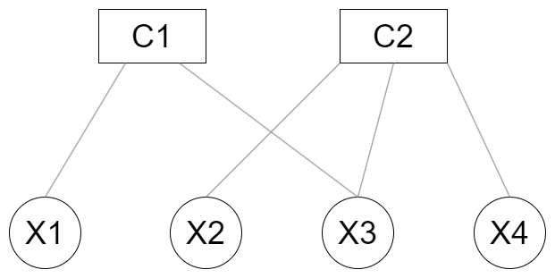
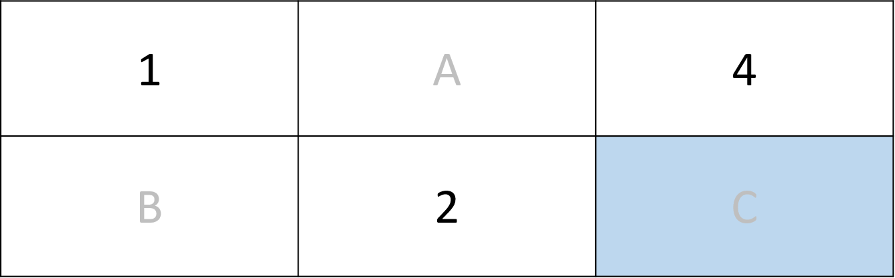
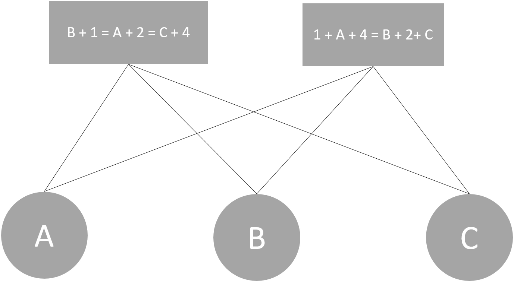

# Consistencia de Arco

Este repositorio tiene como objetivo implementar el algoritmo de arco-consistencia AC-3, una técnica crucial en la resolución de Problemas de Satisfacción de Restricciones. Además de la implementación, se incluirá documentación detallada que explique el funcionamiento del algoritmo, por qué es importante en el contexto de los Problemas de Satisfacción de Restricciones y cómo puede aplicarse. Además se incluiran ejemplos concretos de problemas de satisfacción de restricciones donde la implementación de AC-3 será aplicada. Estos ejemplos servirán como guía práctica para entender cómo integrar y utilizar el algoritmo.

## Introducción

Los Problemas de Satisfacción de Restricciones (PSR o CSP por sus siglas en inglés) son un paradigma común en la inteligencia artificial y la optimización. En un PSR, el objetivo es encontrar una asignación de valores a un conjunto de variables, sujeta a un conjunto de restricciones que deben cumplirse. Estas restricciones expresan relaciones entre las variables y definen el espacio de soluciones válidas para el problema. Los PSR tienen aplicaciones en una variedad de campos, incluyendo la planificación, la programación y la resolución de problemas combinatorios.

El algoritmo de **arco-consistencia** es una técnica fundamental para mejorar la eficiencia en la resolución de PSR. El término "arco" se refiere a pares de variables relacionadas en el problema. La arco-consistencia trabaja propagando restricciones a través de estos arcos para reducir el dominio de las variables. En otras palabras, busca eliminar valores del dominio de una variable que no son consistentes con los valores de las variables relacionadas, lo que resulta en una reducción del espacio de búsqueda.


## Algoritmo

### Modelado de restricciones

En la representación de un PSR, las variables y las restricciones se modelan como vértices en una gráfica bipartita. Las variables constituyen un conjunto de vértices, y las restricciones forman el otro conjunto de vértices. Las aristas de la gráfica conectan variables con restricciones, reflejando así las dependencias entre ellas.

La estructura bipartita permite visualizar de manera clara las relaciones entre las variables y las restricciones, sirviendo como base para la aplicación efectiva de la arco-consistencia.

El algoritmo AC-3 actúa sobre esta gráfica bipartita, realizando un proceso iterativo de propagación de consistencia a través de los arcos. La arco-consistencia se logra eliminando valores inconsistentes de los dominios de las variables
<p align="center">
 
</p>

### Pseudocódigo de AC-3

```
AristasPorProcesar = Todas las aristas.
while AristasPorProcesar != ∅:
    (X, C) = Escoge una arista de AristasPorProcesar y quítala.
    for x in dom(X):
        if no existe y tal que C(x, y) se satisface:
            Quita a x de dom(X) y agrega todas las aristas (Z, D) donde D es una condición que involucra a X y Z ≠ X.
```
---

1. **Inicialización**

Se comienza definiendo el conjunto de _AristasPorProcesar_, que contiene todas las aristas de la gráfica bipartita que representa las relaciones entre variables y restricciones del PSR.

2. **Iteración Principal**

El algoritmo entra en un bucle que se ejecuta mientras haya aristas por procesar en _AristasPorProcesar_. Cada iteración del bucle se centra en una arista específica.

3. **Selección de Arista**

Se elige una arista $(X, C)$ del conjunto _AristasPorProcesar_ y se elimina del conjunto. Esta arista conecta una variable $X$ con una restricción $C$ en la gráfica bipartita.

4. **Consistencia de Arco**

Se realiza un bucle sobre el dominio $dom(X)$ de la variable $X$. Para cada valor $x$ en el dominio, se verifica si existe algún conjunto de valores $\vec{y}$ para el resto de variables, tal que la restricción $C(x, \vec{y})$ se satisface. Si no existe tales valores, significa que el valor $x$ no cumple la arco-consistencia con la restricción $C$.

>_En este punto evaluamos cada valor del dominio de la variable y analizamos si es posible que ese valor pueda cumplir con la restricción con la que está relacionada_


5. **Actualización del Dominio**

En caso de que no exista $\vec{y}$ que satisfaga la restricción para un valor $x$, se elimina $x$ del dominio $dom(X)$. Además, se agregan nuevas aristas al conjunto _AristasPorProcesar_, las cuales son todas aquellas $(Z, D)$ donde la condición $D$ de estas nuevas aristas implica a $X$ y $Z$ sea diferente de $X$.

>_Si no hay forma de que el valor analizado cumpla con la restricción, se quita del dominio de la variable respectiva pues ninguna propuesta de solución que contenga ese valor en esa variable será solución al problema. Esto pudo afectar a otros valores que necesitaban de este para ser consistentes, por lo tanto es necesario volver a revisar ciertas aristas_

6. **Fin de Iteración**

El bucle continúa hasta que no haya más aristas en _AristasPorProcesar_. En este punto se logra la arco-consistencia y garantizamos que todos los valores de las variables son consistentes con las restricciones.

> _Esto no garantiza que cualquier combinación de los valores restantes sea una solución al problema. Para obtener la solución o soluciones finales se necesita realizar una búsqueda sobre los dominios reducidos obtenidos por el algoritmo_ 


## Ejemplo
Vamos a abordar un problema pequeño y directo para simplificar la explicación del funcionamiento del algoritmo la resolución de PSRs. La comprensión de estos conceptos y pasos será fundamental, ya que la solución de problemas más complejos se realiza siguiendo el mismo procedimiento como veremos después.

En la siguiente figura, se deben colocar seis números entre el 1 y el 5 en los cuadrados, de manera que se cumplan las siguientes condiciones:

- La suma de los números en cada renglón debe ser la misma.
- La suma de los números en cada columna debe ser la misma.

Se han proporcionado algunos números en los cuadrados. **¿Puedes determinar qué número debe colocarse en el cuadro sombreado?**


<p align="center">
 
</p>

### Solución
Se observa que este problema puede ser modelado como un PSR, pues hay restricciones muy claras dentro de las instrucciones. Por lo tanto, como primer paso, identificaremos y modelaremos las restricciones del problema. Para esto será util asignar nombres a las las casillas en blanco, ya que estas serán nuestras variables.

<p align="center">
 
</p>

Ahora sí podemos modelar las restricciones en función de las variables. En primer lugar se menciona que la suma de los renglones debe ser la misma, esto puede expresarse de la siguente forma:

$$1 + A + 4 = B + 2+ C$$

Lo cual representa que la suma del primer renglón debe ser igual a la del segundo. Posteriormente también se nos indica que la suma por columnas también debe ser equivalente. Y su expresión quedaría de la siguiente forma:
$$1 +B = A+2 = 4+C$$

Con estas expresiones hemos modelado las restricciones del problema. Ahora la pregunta es si existen valores para $A,B,C \in$ { $1,2,3,4,5$ } tal que se cumplan ambas restricciones. Resolviendo este PSR podremos responder a la pregunta del problema.

<!-- > Notemos que es necesario hacer asignaciones a todas las variables para poder responder la pregunta sobre el valor de la casilla sombreada. Es por esto que es necesario resolver todo el sistema para encontrar la respuesta. -->

Ya que tenemos la modelación de restricciones, variables y sus dominios, podemos obtener la gráfica de restricciones. Recordemos que debe ser una gráfica bipartita donde las restricciones serán un tipo de nodo y las variables otro. Cada nodo de restricción irá unido a las variables que están involucradas en esta.

<p align="center">
 
</p>

> Notemos que la modelación de esta gráfica puede variar (no es única) y esto afectaría directamente al desempeño del algoritmo de arco-consistencia.

Con esta gráfica ya podemos aplicar el algoritmo de arco-consistencia **AC-3** para reducir los dominios de las variables (si es que hay valores que no presentan consistencia de arco). Si se quiere revisar el paso a paso de la aplicación del algoritmo a este problema se puede revisar el siguiente documento: [AC-3 aplicado (paso a paso)](docs/arco_consistencia_aplicada.pdf)

Después de aplicar el algoritmo de arco-consistencia, nos damos cuenta que el dominio de las variables cambió. Esto pasó porque sí existian valores inconsistentes con los arcos de restricciones, por lo tanto se eliminaron. Los nuevos dominios ahora son:


$A  \in$ { $3, 4$ } &nbsp;&nbsp;&nbsp; $B \in$ { $4, 5$ } &nbsp;&nbsp;&nbsp; $C \in$ { $1, 2$ }

Esto ya nos deja con un espacio de búsqueda mucho más manejable. Antes teniamos $5^3$ combinaciones de donde buscar, ahora sólo tenemos $2^3$. Por lo tanto pasamos de 125 combinaciones a tan solo 8 (esta es la ventaja de la arco-consistencia). Estás 8 posibles soluciones incluso se pueden escribir aquí mismo:

1. $A = 3$ &nbsp;&nbsp;&nbsp; $B = 4$ &nbsp;&nbsp;&nbsp; $C = 1$
2. $A = 4$ &nbsp;&nbsp;&nbsp; $B = 4$ &nbsp;&nbsp;&nbsp; $C = 1$
3. $A = 3$ &nbsp;&nbsp;&nbsp; $B = 5$ &nbsp;&nbsp;&nbsp; $C = 1$
4. $A = 4$ &nbsp;&nbsp;&nbsp; $B = 5$ &nbsp;&nbsp;&nbsp; $C = 1$
5. $A = 3$ &nbsp;&nbsp;&nbsp; $B = 4$ &nbsp;&nbsp;&nbsp; $C = 2$
6. $A = 4$ &nbsp;&nbsp;&nbsp; $B = 4$ &nbsp;&nbsp;&nbsp; $C = 2$
7. $A = 3$ &nbsp;&nbsp;&nbsp; $B = 5$ &nbsp;&nbsp;&nbsp; $C = 2$
8. $A = 4$ &nbsp;&nbsp;&nbsp; $B = 5$ &nbsp;&nbsp;&nbsp; $C = 2$